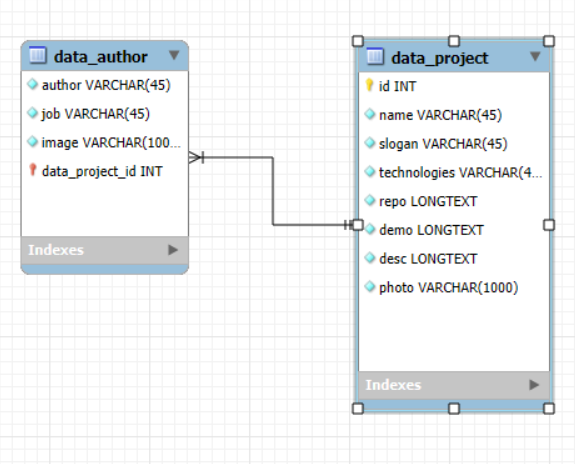

# 🛠️ Backend API - Gestor de Proyectos

Este proyecto backend fue desarrollado con Node.js, Express y MySQL. Su objetivo es gestionar un sistema de proyectos y autores, permitiendo realizar operaciones CRUD básicas y servir datos a un frontend React.

---

## 🚀 Tecnologías utilizadas

- **Node.js** con Express
- **MySQL** y MySQL Workbench
- **Postman** (para testeo de endpoints)
- **dotenv** (para variables de entorno)
- **CORS** y middleware JSON
- **Render** para despliegue online
- **Diagramas ER** y estructura de base de datos creados con MySQL Workbench

---

## 📁 Estructura de carpetas

```
/root
│
├── .env
├── /backend
│   └── index.js
│
├── /FRONTEND-REACT
│   └── index.html / App.jsx / etc.
│
└── /public_html
    └── error404.html
```

---

## 🧩 Base de datos

Se utilizaron dos tablas principales:

- `data_project` – contiene información de los proyectos (nombre, tecnologías, repositorio, demo, imagen, etc.)
- `data_author` – contiene datos de los autores y una relación con el proyecto correspondiente (`data_project_id`)

El diagrama de relaciones fue generado en **MySQL Workbench** y establece una **relación 1:N entre proyectos y autores**.

---

## 🗺️ Diagrama Entidad-Relación (ER)

El siguiente diagrama muestra la estructura de la base de datos:



---

## 📮 Endpoints disponibles

### `GET /api/projects`

- Devuelve todos los proyectos y sus autores.
- Si se pasa un query param `id`, devuelve solo el proyecto con ese ID.

**Ejemplo:**

```
GET /api/projects?id=3
```

---

### `POST /api/projects`

- Crea un nuevo proyecto y su autor asociado.
- Espera un `body` con esta estructura:

```json
{
  "name": "Nombre del proyecto",
  "slogan": "Slogan del proyecto",
  "technologies": "HTML, CSS, JS",
  "repo": "https://github.com/...",
  "demo": "https://demo.com",
  "desc": "Descripción del proyecto",
  "photo": "base64 o URL",
  "author": "Nombre autora",
  "job": "Front-end Developer",
  "image": "https://imagen.com"
}
```

**Respuesta esperada:**

```json
{
  "success": true,
  "id": 5,
  "cardURL": "https://proyecto-promo-53-module-4-team-2-2.onrender.com5"
}
```

---

## 🧪 Pruebas con Postman

Durante el desarrollo se utilizó **Postman** para testear los endpoints `GET` y `POST`. Se validaron las respuestas con distintos escenarios: datos válidos, errores, campos faltantes o sin conexión a la base de datos.

---

## ❌ Página 404

El servidor responde con una página personalizada `error404.html` para rutas no definidas.

---

## 📌 Notas adicionales

- El backend sirve el frontend de React desde `../FRONTEND-REACT`.
- Las rutas no válidas devuelven una página 404 personalizada.
- Código modular y preparado para escalar en futuros desarrollos.

---

## 👩‍💻 Autora

Camila Bedoya — FullStack Developer  
📫 [LinkedIn](https://www.linkedin.com/in/camila-bedoya/) — milabs.esp24@gmail.com

